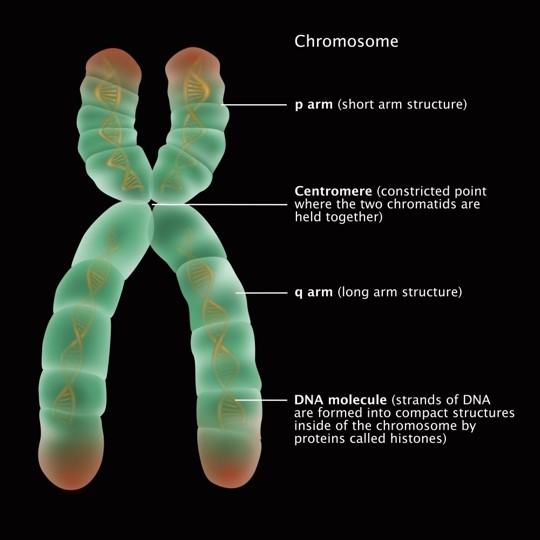
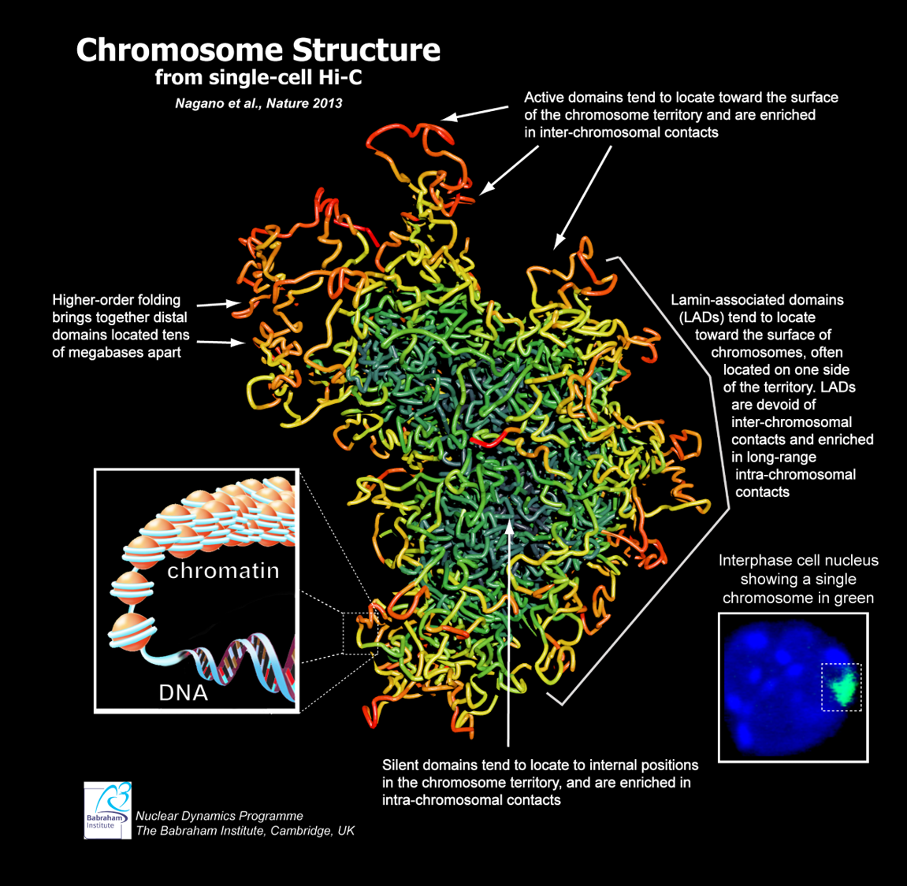
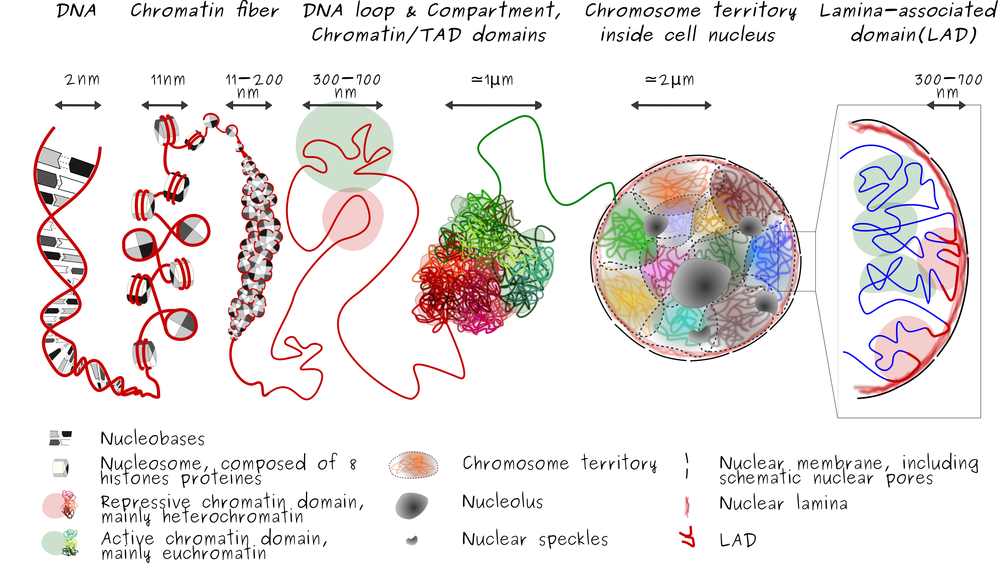
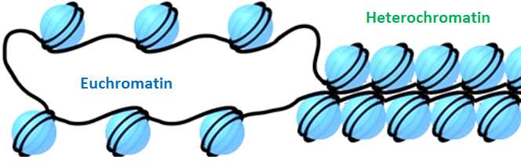

# 대충 알아보는 genomics

Genome (유전체)는 생명을 이루는 모든 것에 대한 정보를 담고 있는 하나의 설계도이다. 세균, 식물, 동물, 그리고 인간에 이르기까지 모두 각자의 유전자를 담고 있으며, 이는 DNA에서 A, T, G, C 염기들의 서열로 이루어져 있다. 

## 유전자와 DNA는 다르다
유전체, 염색체 (chromosome), 유전자 (gene), DNA 모두 다 다른 의미를 가지고 있다. Genome은 한 개체가 가지고 있는 유전 정보를 통틀어서 지칭하는 말이다. 

위 그림은 생명체의 유전물질들이 어떻게 구조를 이루고 구분되는지를 나타낸다. 특히 chromosome은 우리가 생물학 교과서에서 배우는 대표적인 형태인 X자 형태로 그려져있다. 

  
*<small>Chromosome을 일반적으로 설명할 때 나타내는 그림. X자 형태로 그리는 것이 특징이다.</small>*

고등학교에서 우리는chromosome (염색체)는 인간 세포에 총 46개가 있다고 배운다. 그리고 X자 모양의 염색체가 그려져 있고, 세포 분열할 때 양쪽으로 뜯어져서 각각 나눠진다고 알고 있다. Chromosome에 대해 아주 좋은 설명이지만, 사실 실제 chromosome은 이보다 더욱 세세한 형태들로 이루어져 있다. 예를 들어, 위 그림의 chromosome은 한 쌍의 chromatids (염색분체)로 이루어져 있다. 이 chromatids 쌍은 세포 분열을 위해서 DNA가 2배로 복제된 것이 합쳐진 것이다. 즉, 일반적인 경우에는 저렇게 2개의 똑같은 DNA 덩어리가 붙어서 존재하지 않다는 것이다. 그럼 실제 chromosome은 어떤 형태로 있을까?

## Chromosome의 실제 형태
> Chromosome은 X 모양으로 생기지 않았다.

  
*<small>Hi-C로 측정한 데이터로 재구성한 chromosome의 구조. (Nagano et al., Nature 2013). 전체 genomic DNA가 아니라 오른쪽 하단에 초록색으로 표시된 영역의 1개의 chromosome만을 표현한 것이다.</small>*

평소의 chromosome은 위 그림과 같이 실 뭉치가 대충 엉켜있는 형태로 존재한다. 사실 이런 형태가 X자 형태보다 훨씬 자연스럽다. X자 형태로 꽉꽉 뭉쳐져 있으면 DNA에 그 어떤 단백질도 다가가기 힘들고 유전자에서 전사 - 번역 등의 과정도 일어나기 힘들 것 같기 때문이다. 

위 그림에서 보면, chromosome에서도 색이 구분되어 그려져 있는데, 이는 해당 부분이 얼마나 활성화된 영역인지 나타낸다. 예를 들어, 바깥쪽으로 자유롭게 노출되어있는 영역은 붉은 색으로 표시되어 있다. 이는 'active domain'이라고 한다. 이렇게 chromosome 내에서도 chromatin fiber의 위치와 형태에 따라서 구조적 domain이 나뉜다.  Chromosome의 각각의 domain에 대해서 자세히 알아보자.

  
*<small>핵 내부에 존재하는 genome을 나타낸 그림 (by Brunet, A.). LAD가 nuclear lamina에 붙어있는 것을 볼 수 있다.</small>*

### Lamin-associated domain (LAD)
각각의 chromosome은 핵 안에서 엉겨있는 형태로 자신만의 영역을 차지하는데, 이를 chromosome territory라고 한다. 세포의 핵 내부를 보면 chromosome들이 각각의 territory를 차지하고 있다. 이런 영역은 꽤 일정한 패턴으로 유지되는 것처럼 나타나는데, 이는 'Lamin-associated domain (LAD) 덕분이다. Lamin (또는 lamina)는 세포의 핵의 모양을 유지해주는 그물 형태의 단백질 구조체인데, chromosome의 LAD는 이 lamina에 달라붙어서 자신의 영역을 고정하기도 한다. 

### Topologically associated domains (TADs)
TAD란 chromosome 상에서 3차원 구조를 이루면서 서로간의 상호작용이 일어나는 유전체 지역을 의미한다. 단순히 genomic DNA 서열 상으로만 봤을 때에는 매우 멀리 떨어져있는 것 같은 위치도, 3차원 구조로 핵 내부에 꼬여 있을 때에는 매우 가까이 붙어서 서로 영향을 주고 받을 수 있다. 예를 들어, 유전자의 발현을 조절하는 enhancer 등이 멀리 떨어져 있어도 특정 유전자의 발현에 영향을 미치는 경우가 이에 해당한다. 

### Euchromatin & heterochromatin

Chromosome을 좀 더 작은 단위로 보면 DNA가 histon 단백질에 감겨있는 크로마틴 (chromatin)이 매우 조밀하게 모여있는 구조이다. 이때, chromatin은 크게 2가지 상태로 나뉜다. 하나는 DNA가 histon 단백질에서 낮은 밀도로 풀려있는 euchromatin이고, 다른 하나는 DNA가 histon 단백질에 매우 조밀하게 감싸져서 압축되어 있는 heterochromatin이다. 이 chromatin이 서로 뭉쳐있는 밀도가 낮을 수록 우리는 chromatin이 열려있다 (open chromatin), 활성상태이다 (active chromatin), 혹은 접근성(chromatin accesibility)이 좋다고 말한다. 

