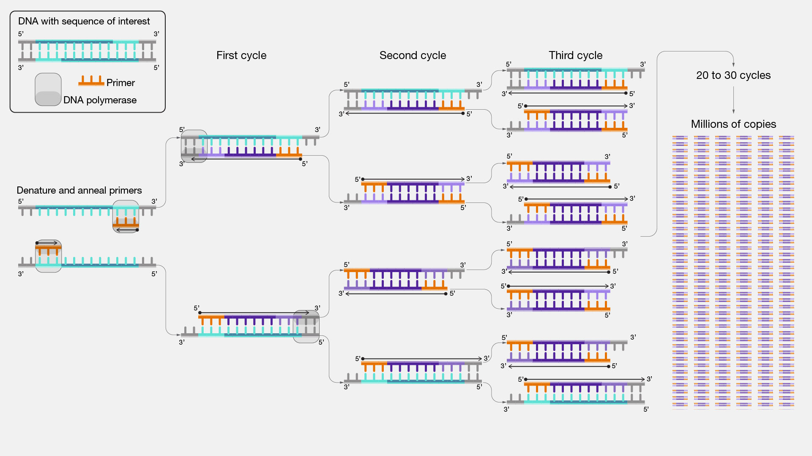

# PCR

PCR은 특정 DNA를 template으로 사용해서 원하는 위치를 대량으로 증폭하는 기술이다. DNA를 다루는 연구실에서 가장 기초적인 실험으로 정말 많이 사용된다. 이미 protocol들이 잘 정리된 것들이 많이 있지만, 각 실험 디자인과 연구 목적에 따라서 PCR에 대한 조건을 세세하게 설정해야 하는 것들이 있다. 

PCR은 다음의 목적을 위해 수행한다.
* DNA sample에 특정 유전자 및 DNA 서열이 존재하는지 확인
* 클로닝 벡터에 넣을 insert를 준비
* DNA 서열을 시퀀싱 하기 위한 샘플을 준비

### Template과 primer

PCR은 template DNA가 고열에 의해 떨어지고, primer가 달라붙어서 DNA polymerase에 의해 새로운 DNA 가닥이 합성되는 과정을 반복한다. 이론적으로 매 cycle마다 DNA copy 양이 2배씩 늘어나게 되므로, 일정 cycle이 넘어가는 순간부터 기하급수적으로 DNA copy가 급증하게 된다. 이를 통해 우리가 원하는 DNA fragment를 증폭하는 것이다. 

DNA를 PCR하기 위해서는 template를 정하고, primer를 준비해야 한다. DNA template은 본인의 연구 주제와 실험 내용에 따라 결정되는 경우가 많지만, primer는 실험자가 직접 디자인하고 주문해서 사용해야 하는 경우가 많다. Primer는 주로 아래의 기준으로 정한다. 

> 1. 순방향 프라이머 (FP)와 역방향 프라이머 (RP)의 melting temperature (Tm)을 60C에 가깝게 맞추고, FP와 RP 간의 Tm 차이가 3C 이상 나지 않게 한다.
> 2. 다른 비슷한 서열의 원하지 않는 위치에 붙지 않도록 주의해서 설계해야 한다.
> 3. Primer의 길이는 주로 20nt에서 +/- 2nt 정도 길이로 결정한다. Tm이 조건에 맞더라도 너무 짧으면 specificity가 떨어질 수 있으니, 너무 짧게 디자인하지 않도록 주의한다.
> 4. Primer의 맨 앞과 맨 끝은 가급적 G/C가 오도록 디자인한다. 

### DNA polymerase
DNA polymerase를 어떤 것으로 선택하는지는 PCR 과정에서 매우 중요하다. 흔히 많이 쓰이는 Taq polymerase는 가격이 저렴하고 PCR 증폭 효율과 속도가 뛰어나지만 error rate이 높다. 즉, PCR을 돌릴 수록 원치않는 mutation이 생긴 DNA fragment가 생길 가능성이 높다는 것이다. 이를 개선하기 위해 다양한 polymerase들이 개발되고 상용화되었다. 아래는 대표적인 DNA polymerase들이다. 

| Polymerase         | Company | 특징                                                |
| ------------------ | ------- | ------------------------------------------------- |
| Taq                | Solgent | 가장 흔하게 쓰이는 polymerase. Error rate이 높은 편이지만, 저렴하다. |
| Pfu                | Solgent | Taq polymerase 보다 error rate이 낮다.                 |
| Phusion            | NEB     | Pfu를 개량해 만든 것으로 PCR 효율이 높지만 가격이 비싸다.              |
| Q5                 | NEB     | Taq을 개량해 만든 것으로 PCR 효율과 fedelity가 가장 높지만 가격이 비싸다. |
| GXL                | Takara  | PCR효율과 feldelity 둘 다 높으며, Q5보다 약간 저렴하다.           |
| KAPA HiFi HotStart | Roche   | PCR효율과 feldelity 둘 다 높으며, Q5보다 약간 저렴하다.           |

각 polymerase들은 각각의 PCR cycle protocol이 정해져 있으며, 자세한 내용들은 각각의 제품 제조회사의 홈페이지에 자세히 설명되어 있다. 하지만 각 실험실과 개개인의 필요에 따라 적절하게 조정해서 사용하면 된다. 예를 들어, 우리 실험실에서 사용하는 Q5 polymerase의 일반적인 PCR protocol은 아래와 같다. 
> 98C (5min) - [98c (20s) - 60c (20s) - 72c (xx s)] x 26 Cycles - 72c (3min) - 16c (hold)

위의 PCR 과정의 각각의 단계의 의미는 아래와 같다. 

| 온도  | Cycle        | 설명                                                                                              |
| --- | ------------ | ----------------------------------------------------------------------------------------------- |
| 98c | X            | 처음 dsDNA template을 완전히 ssDNA로 분리해주는 단계. 동시에 특정 polymerase의 경우에는 효소를 활성화시켜주는 hot-start 단계이기도 하다. |
| 98c | 25-35 cycles | Denature: 매 cycle마다 dsDNA를 완전히 ssDNA로 분리해주는 단계.                                                 |
| 60c | 25-35 cycles | Annealing: 각 ssDNA에 primer들이 달라붙는 단계                                                            |
| 72c | 25-35 cycles | Polymerization: Primer가 붙은 위치에 poylermase가 붙으면서 template에 맞게 상보적인 DNA strand를 합성하는 단계. 증폭하려는 DNA product의 길이가 길어질수록 이 과정의 반응 시간도 비례해서 늘려줘야 한다.           |
| 72c | X            | Cycle이 모두 끝나고 아직 완전히 polymerization이 끝나지 않은 반응을 충분히 마무리 하기 위한 시간                                |
| 16c | X            | 모든 반응이 끝난 DNA fragment들을 안정한 상태로 유지하기 위한 단계.                                                    |

### Agarose gel에서 PCR 결과 확인
PCR 반응이 일어났는지 확인하는 가장 확실한 방법은 눈으로 DNA fragment를 직접 확인하는 것이다. 

### PCR trouble shooting
PCR은 기초적인 실험이긴 하지만, 매 실험마다 세세하게 최적화를 해야하는 조건들이 많이 있다. 대부분의 경우는 크게 2가지이다. 
* PCR 증폭이 안 일어나서 gel에서 밴드가 안 보이는 경우
* 비특이적으로 다른 product들도 같이 증폭이되어서 gel에서 multi band가 보이는 경우

